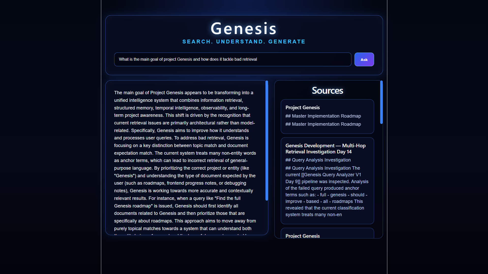

# Genesis

> Open Source Semantic Intelligence Platform

**98.75% Recall@5 • 59ms Average Retrieval Latency • 2,000+ Notes Indexed**

Genesis is a local-first semantic intelligence platform that transforms personal knowledge bases into searchable, explainable, AI-assisted systems.

Built around Obsidian vaults, Genesis combines lexical search, semantic retrieval, query analysis, and local language models to provide grounded answers backed by source material.

Unlike traditional AI assistants, Genesis prioritizes retrieval quality, transparency, evaluation, and user ownership. Every major retrieval component is measurable, debuggable, and designed to run locally.

---

## Demo


*Natural language search, hybrid retrieval, source attribution, and grounded AI responses powered entirely by local infrastructure.*

---

## Key Metrics

| Metric                    | Result                 |
| ------------------------- | ---------------------- |
| Notes Indexed             | 2,000+                 |
| Benchmark Queries         | 80                     |
| Recall@5                  | 98.75%                 |
| Average Found Rank        | 1.58                   |
| Average Retrieval Latency | 59ms                   |
| Retrieval Strategy        | Hybrid Retrieval + RRF |
| AI Runtime                | Ollama                 |
| Storage                   | SQLite + ChromaDB      |

---

## Why Genesis?

Modern AI assistants are only as useful as the information they can retrieve.

Genesis was created to explore how local AI systems can combine structured retrieval, semantic search, and contextual reasoning to provide grounded answers over large personal knowledge bases.

The project began as a retrieval engine for Obsidian vaults and has evolved into a semantic intelligence platform focused on search quality, observability, evaluation, and long-term knowledge management.

---

## Core Capabilities

### Retrieval Engine

* SQLite FTS5 lexical retrieval
* ChromaDB semantic retrieval
* Hybrid retrieval architecture
* Reciprocal Rank Fusion (RRF)
* Query analysis and optimization
* Retrieval diagnostics and tracing
* Source attribution and evidence tracking

### Knowledge Management

* Obsidian vault ingestion
* Markdown parsing
* Paragraph-aware chunking
* Incremental indexing
* Content hash synchronization
* Deleted note cleanup
* Metadata tracking
* Vector store synchronization

### Local AI Integration

* Local embedding generation
* Local language model integration
* Context assembly
* Grounded answer generation
* Source-backed responses
* Fully local workflow

### Evaluation & Observability

* Automated retrieval benchmark suite
* Recall@K measurement
* Retrieval latency instrumentation
* Ranking diagnostics
* Performance tracing
* Retrieval evaluation harness

---

## Technology Stack

| Category        | Technology                   |
| --------------- | ---------------------------- |
| Language        | Python                       |
| Frontend        | React + TypeScript           |
| Backend         | FastAPI                      |
| Database        | SQLite                       |
| Vector Database | ChromaDB                     |
| Retrieval       | FTS5 + Semantic Search + RRF |
| AI Runtime      | Ollama                       |
| Embeddings      | nomic-embed-text             |
| LLM             | qwen2.5:7b                   |
| Source Data     | Obsidian Vaults              |
| Version Control | Git + GitHub                 |

---

## Architecture

```text
                Obsidian Vault
                        │
                        ▼
                Markdown Parsing
                        │
                        ▼
            Paragraph-Aware Chunking
                        │
                        ▼
              Embedding Generation
                        │
        ┌───────────────┴───────────────┐
        ▼                               ▼

 SQLite Metadata Storage      ChromaDB Vector Store
      (FTS5 Search)              (Semantic Search)

        └───────────────┬───────────────┘
                        ▼

                 Query Analysis
                        │
                        ▼

                 Hybrid Retrieval

              Lexical + Semantic

                        │
                        ▼

          Reciprocal Rank Fusion (RRF)

                        │
                        ▼

          Retrieval Diagnostics & Timing

                        │
                        ▼

                 Context Assembly

                        │
                        ▼

                  Ollama Runtime
                 (qwen2.5:7b)

                        │
                        ▼

              Grounded AI Response
```

---

## Retrieval Performance

Genesis includes a dedicated retrieval evaluation harness used to measure retrieval quality and system performance.

### Latest Benchmark Results

| Metric                    | Result  |
| ------------------------- | ------- |
| Queries Evaluated         | 80      |
| Recall@5                  | 98.75%  |
| Average Found Rank        | 1.58    |
| Average Retrieval Latency | 59ms    |
| Pass Rate                 | 79 / 80 |

The benchmark suite evaluates retrieval performance across:

* Hybrid Retrieval
* Query Analysis
* Embeddings
* Context Assembly
* Incremental Indexing
* Local AI Integration
* Knowledge Management
* Information Retrieval Concepts

---



The current Genesis interface provides a local-first search experience for exploring and interacting with a personal knowledge base.

Features currently available:

* Natural language search
* AI-assisted question answering
* Source attribution
* Retrieval-backed responses
* Local-first workflow

---

## Installation

Clone the repository:

```bash
git clone https://github.com/vancesystems/Genesis.git
cd Genesis
```

Install dependencies:

```bash
pip install -r requirements.txt
```

Install required Ollama models:

```bash
ollama pull qwen2.5:7b
ollama pull nomic-embed-text
```

Run Genesis:

```bash
python main.py
```

---

## Project Status

### Completed

* Markdown Vault Ingestion
* Incremental Indexing
* Paragraph-Aware Chunking
* SQLite Metadata Storage
* ChromaDB Integration
* Semantic Retrieval
* Lexical Retrieval
* Hybrid Retrieval
* Query Analysis
* Reciprocal Rank Fusion (RRF)
* Retrieval Diagnostics
* Retrieval Evaluation Harness
* Local LLM Integration
* Grounded Responses
* React Frontend
* FastAPI Backend

### In Progress

* Improved Retrieval Ranking
* Enhanced Evaluation Coverage
* Frontend Refinement
* Retrieval Performance Optimization

### Planned

* Structured Memory Layer
* Graph-Aware Retrieval
* Relationship Discovery
* Long-Term Context Systems
* Project Intelligence Layer
* Knowledge Relationship Mapping
* Advanced Evaluation Metrics

---

## Design Philosophy

### Retrieval Before Generation

High-quality answers begin with high-quality retrieval.

### Transparency Before Magic

Retrieval decisions should be observable, explainable, and measurable.

### Local First

Users should retain ownership of their knowledge, models, and data.

### Evaluation Before Complexity

Every major capability should be benchmarked before expansion.

---

## Vision

Genesis is evolving beyond a traditional retrieval system toward a semantic intelligence platform capable of understanding, organizing, and reasoning over personal knowledge.

The long-term objective is to create a local-first intelligence layer that helps users retrieve information, preserve context, discover relationships, and build understanding over time.
