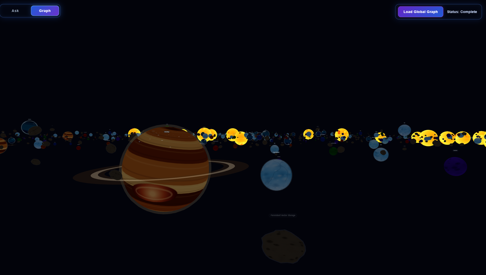
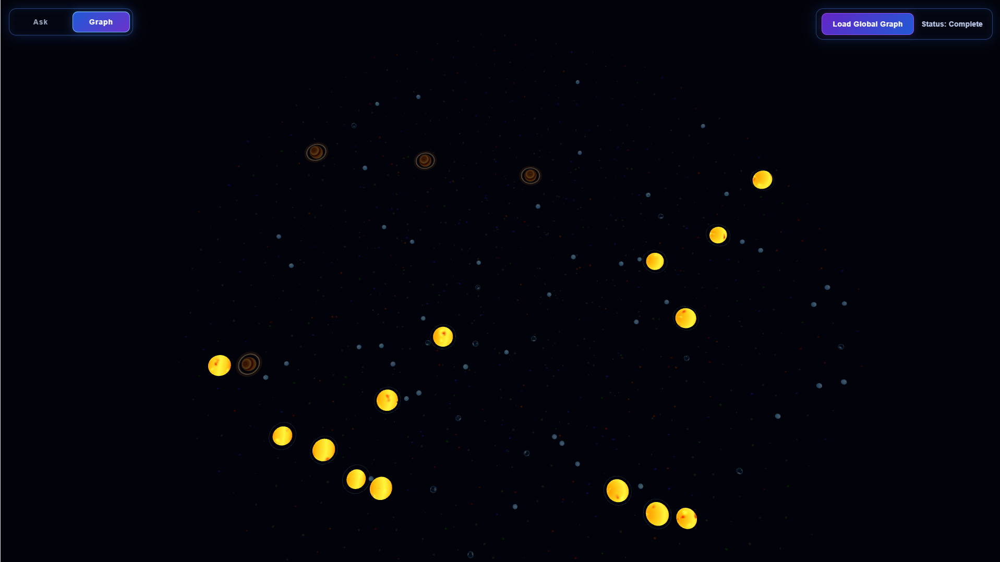
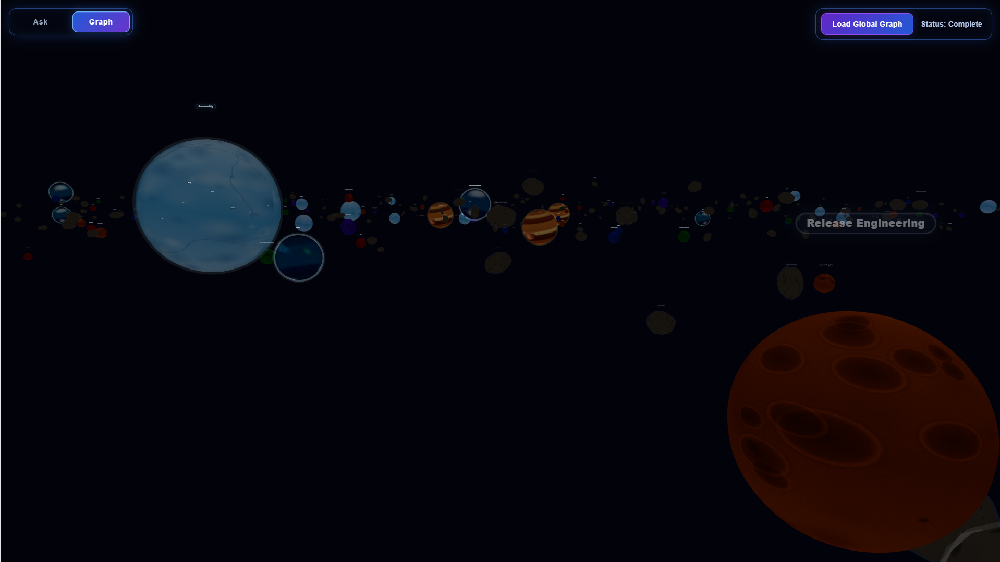

# Genesis

> Open Source Semantic Intelligence Platform

**98.75% Top-5 Retrieval Success • 0.79 MRR • 59ms Average Retrieval Latency • 2,000+ Notes Indexed • Three.js Galaxy Graph v1**

Genesis is a local-first semantic intelligence platform that transforms personal knowledge bases into searchable, explainable, AI-assisted systems.

Built around Obsidian vaults, Genesis combines lexical search, semantic retrieval, query analysis, local language models, and an interactive Three.js knowledge graph to provide grounded answers backed by source material.

Unlike traditional AI assistants, Genesis prioritizes retrieval quality, transparency, evaluation, visual exploration, and user ownership. Every major retrieval component is measurable, debuggable, and designed to run locally.

---

## Demo


*Natural language search, hybrid retrieval, source attribution, and grounded AI responses powered entirely by local infrastructure.*

---

## Three.js Galaxy Graph



*Genesis now includes a v1 Three.js-powered galaxy graph that transforms an Obsidian vault into an explorable 3D knowledge system.*

Instead of rendering every note as another point in a traditional graph, Genesis classifies notes by connection mass and visualizes them as asteroids, dwarf planets, planets, gas giants, and stars.

The galaxy graph is designed to make large personal knowledge bases easier to explore visually while preserving the underlying structure of the note graph.

Current Galaxy Graph v1 features:

* Global graph rendering
* Three.js-powered 3D visualization
* Procedural galaxy layout
* Node mass classification
* Asteroids, dwarf planets, planets, gas giants, and stars
* Modular planet body rendering
* Dynamic node labels
* Instanced asteroid rendering
* Orbit-style system visualization
* Scalable rendering for 2,000+ notes

---

## Key Metrics

| Metric                    | Result                 |
| ------------------------- | ---------------------- |
| Notes Indexed             | 2,000+                 |
| Benchmark Queries         | 80                     |
| Top-5 Retrieval Success   | 98.75%                 |
| Mean Reciprocal Rank (MRR)| 0.79                   |
| Average Found Rank        | 1.58                   |
| Average Retrieval Latency | 59ms                   |
| Retrieval Strategy        | Hybrid Retrieval + RRF |
| AI Runtime                | Ollama                 |
| Storage                   | SQLite + ChromaDB      |
| Graph Visualization       | Three.js + React       |

---

## Why Genesis?

Modern AI assistants are only as useful as the information they can retrieve and the context they can help users understand.

Genesis was created to explore how local AI systems can combine structured retrieval, semantic search, contextual reasoning, and visual knowledge exploration to provide grounded answers over large personal knowledge bases.

The project began as a retrieval engine for Obsidian vaults and has evolved into a semantic intelligence platform focused on search quality, observability, evaluation, long-term knowledge management, and interactive graph-based exploration.

---

## Core Capabilities

### Retrieval Engine

* SQLite FTS5 lexical retrieval
* ChromaDB semantic retrieval
* Hybrid retrieval architecture
* Reciprocal Rank Fusion (RRF)
* Query analysis and optimization
* Retrieval diagnostics and tracing
* Source attribution and evidence tracking

### Knowledge Management

* Obsidian vault ingestion
* Markdown parsing
* Paragraph-aware chunking
* Incremental indexing
* Content hash synchronization
* Deleted note cleanup
* Metadata tracking
* Vector store synchronization

### Local AI Integration

* Local embedding generation
* Local language model integration
* Context assembly
* Grounded answer generation
* Source-backed responses
* Fully local workflow

### Galaxy Graph Visualization

* Three.js-powered global graph
* React-based interactive graph UI
* Procedural 3D galaxy layout
* Node classification by connection mass
* Asteroids, dwarf planets, planets, gas giants, and stars
* Modular planet visual components
* Node label rendering
* Instanced asteroid rendering
* Orbit-based visual systems
* Scalable rendering for large note vaults

### Evaluation & Observability

* Automated retrieval benchmark suite
* Recall@K measurement
* Retrieval latency instrumentation
* Ranking diagnostics
* Performance tracing
* Retrieval evaluation harness

---

## Technology Stack

| Category        | Technology                   |
| --------------- | ---------------------------- |
| Language        | Python                       |
| Frontend        | React + TypeScript           |
| 3D Rendering    | Three.js + React Three Fiber |
| Backend         | FastAPI                      |
| Database        | SQLite                       |
| Vector Database | ChromaDB                     |
| Retrieval       | FTS5 + Semantic Search + RRF |
| AI Runtime      | Ollama                       |
| Embeddings      | nomic-embed-text             |
| LLM             | qwen2.5:7b                   |
| Source Data     | Obsidian Vaults              |
| Version Control | Git + GitHub                 |

---

## Architecture

```text
                Obsidian Vault
                        │
                        ▼
                Markdown Parsing
                        │
                        ▼
            Paragraph-Aware Chunking
                        │
                        ▼
              Embedding Generation
                        │
        ┌───────────────┴───────────────┐
        ▼                               ▼

 SQLite Metadata Storage      ChromaDB Vector Store
      (FTS5 Search)              (Semantic Search)

        └───────────────┬───────────────┘
                        ▼

                 Query Analysis
                        │
                        ▼

                 Hybrid Retrieval

              Lexical + Semantic

                        │
                        ▼

          Reciprocal Rank Fusion (RRF)

                        │
                        ▼

          Retrieval Diagnostics & Timing

                        │
                        ▼

                 Context Assembly

                        │
                        ▼

                  Ollama Runtime
                 (qwen2.5:7b)

                        │
                        ▼

              Grounded AI Response
```

---

## Galaxy Graph Architecture

```text
                Obsidian Vault
                        │
                        ▼
                 Notes + Links
                        │
                        ▼
              Global Graph Builder
                        │
                        ▼
             Node Mass Calculation
                        │
                        ▼
        ┌───────────────┴───────────────┐
        ▼                               ▼

  Visual Classification          Graph Positioning
 Asteroid / Planet / Star        Galaxy Layout System

        └───────────────┬───────────────┘
                        ▼

             Three.js Galaxy Renderer
                        │
                        ▼

        Modular Planet + Star Components
                        │
                        ▼

      Labels, Orbits, Instanced Asteroids
                        │
                        ▼

          Interactive 3D Knowledge Graph
```

---

## Retrieval Performance

Genesis includes a dedicated retrieval evaluation harness used to measure retrieval quality and system performance.

### Latest Benchmark Results

| Metric                    | Result  |
| ------------------------- | ------- |
| Queries Evaluated         | 80      |
| Top-5 Retrieval Success   | 98.75%  |
| Mean Reciprocal Rank (MRR)| 0.79    |
| Average Found Rank        | 1.58    |
| Average Retrieval Latency | 59ms    |
| Pass Rate                 | 79 / 80 |

The benchmark suite evaluates retrieval performance across:

* Hybrid Retrieval
* Query Analysis
* Embeddings
* Context Assembly
* Incremental Indexing
* Local AI Integration
* Knowledge Management
* Information Retrieval Concepts

---

## Interface


The current Genesis interface provides a local-first search experience for exploring and interacting with a personal knowledge base.

Features currently available:

* Natural language search
* AI-assisted question answering
* Source attribution
* Retrieval-backed responses
* Local-first workflow
* Global knowledge graph view
* Three.js galaxy visualization

---

## Galaxy Graph Screenshots



*Global galaxy view generated from a 2,000+ note Obsidian vault.*



*Node labels make the galaxy graph navigable while preserving the visual structure of the knowledge base.*

---

## Installation

Clone the repository:

```bash
git clone https://github.com/vancesystems/Genesis.git
cd Genesis
```

Install dependencies:

```bash
pip install -r requirements.txt
```

Install required Ollama models:

```bash
ollama pull qwen2.5:7b
ollama pull nomic-embed-text
```

Run Genesis:

```bash
python main.py
```

---

## Project Status

### Completed

* Markdown Vault Ingestion
* Incremental Indexing
* Paragraph-Aware Chunking
* SQLite Metadata Storage
* ChromaDB Integration
* Semantic Retrieval
* Lexical Retrieval
* Hybrid Retrieval
* Query Analysis
* Reciprocal Rank Fusion (RRF)
* Retrieval Diagnostics
* Retrieval Evaluation Harness
* Local LLM Integration
* Grounded Responses
* React Frontend
* FastAPI Backend
* Global Galaxy Graph
* Three.js Graph Rendering
* Procedural Planet Visuals
* Node Labels
* Instanced Asteroid Rendering
* Modular Galaxy Rendering Structure

### In Progress

* Improved Retrieval Ranking
* Enhanced Evaluation Coverage
* Frontend Refinement
* Retrieval Performance Optimization
* Galaxy Graph Visual Refinement
* Camera Controls
* Relationship Visualization
* Semantic Graph Clustering

### Planned

* Structured Memory Layer
* Graph-Aware Retrieval
* Relationship Discovery
* Long-Term Context Systems
* Project Intelligence Layer
* Knowledge Relationship Mapping
* Advanced Evaluation Metrics
* AI-Powered Graph Exploration
* Agentic Research Workflow
* Solar System-Level Navigation

---

## Design Philosophy

### Retrieval Before Generation

High-quality answers begin with high-quality retrieval.

### Transparency Before Magic

Retrieval decisions should be observable, explainable, and measurable.

### Local First

Users should retain ownership of their knowledge, models, and data.

### Evaluation Before Complexity

Every major capability should be benchmarked before expansion.

### Exploration Before Static Views

Large knowledge bases should not only be searched. They should be explored, mapped, and understood visually.

---

## Vision

Genesis is evolving beyond a traditional retrieval system toward a semantic intelligence platform capable of understanding, organizing, visualizing, and reasoning over personal knowledge.

The long-term objective is to create a local-first intelligence layer that helps users retrieve information, preserve context, discover relationships, explore knowledge visually, and build understanding over time.