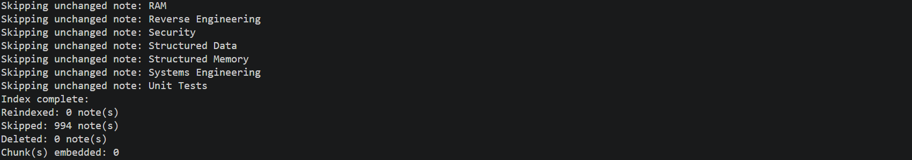
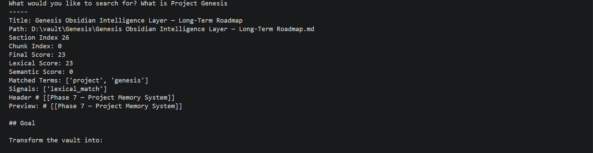
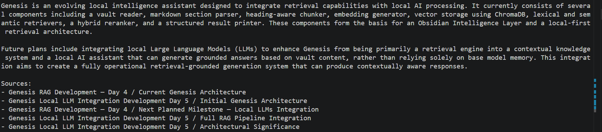

# Genesis

Genesis is a local-first semantic retrieval and AI assistant system built around an Obsidian vault.

The project is designed to transform a collection of notes into an intelligent knowledge system capable of retrieval, contextual understanding, and grounded AI responses.

Genesis currently focuses on:

* Semantic search
* Hybrid retrieval
* Local AI reasoning
* Contextual vault intelligence

---

## Current Features

* Markdown vault ingestion
* Heading-aware chunking
* Local embedding generation through Ollama
* ChromaDB vector storage
* Lexical + semantic hybrid retrieval
* Retrieval tracing and scoring visibility
* Grounded AI responses with source attribution
* Incremental indexing with content-hash change detection
* Skipping unchanged notes for faster indexing
* Deleted note cleanup and vector synchronization

---

## Current Stack

* Python
* Ollama
* ChromaDB
* Local LLMs
* Local embedding models
* SQLite

---

## Current Models

Embedding Model:

* `nomic-embed-text`

LLM:

* `qwen2.5:7b`

---

## Architecture

```text
Vault Files
    ↓
Markdown Parsing
    ↓
Heading-Aware Chunking
    ↓
Embedding Generation
    ↓
Vector Storage
    ↓
Hybrid Retrieval
    ↓
Context Assembly
    ↓
Local AI Reasoning
```

---

## Screenshots

### CLI Interface

The current Genesis interface is terminal-based and provides access to indexing, retrieval, and AI interaction workflows.


---

### Incremental Indexing System

Genesis tracks content changes through hashing and avoids rebuilding unchanged notes. This significantly reduces unnecessary processing time when working with larger vaults.



---

### Hybrid Retrieval Trace

Genesis combines lexical matching with semantic retrieval and exposes scoring signals to make retrieval behavior transparent during development.

This output shows:

* lexical score contribution
* semantic score contribution
* matched terms
* retrieval signals
* source metadata



---

### Grounded AI Responses

Responses are generated using retrieved vault context rather than relying entirely on model memory. Source references are included to show where information originated.



---

## Planned Features

* SQLite structured memory layer
* Graph-aware retrieval
* Relationship discovery
* Project memory systems
* Long-term contextual intelligence
* TypeScript frontend
* Backlinks and knowledge relationships
* Conversation history and persistent context

---

## Goal

The long-term goal of Genesis is to evolve beyond a simple chatbot into:

> A local semantic intelligence system designed for engineering knowledge, retrieval, and contextual reasoning.

The aim is to create an AI system that does more than answer questions — one that can build understanding, preserve context, and act as a long-term knowledge companion.
